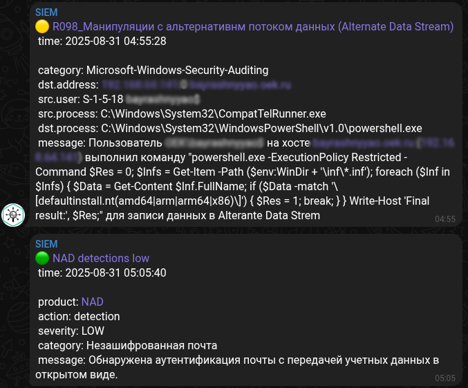
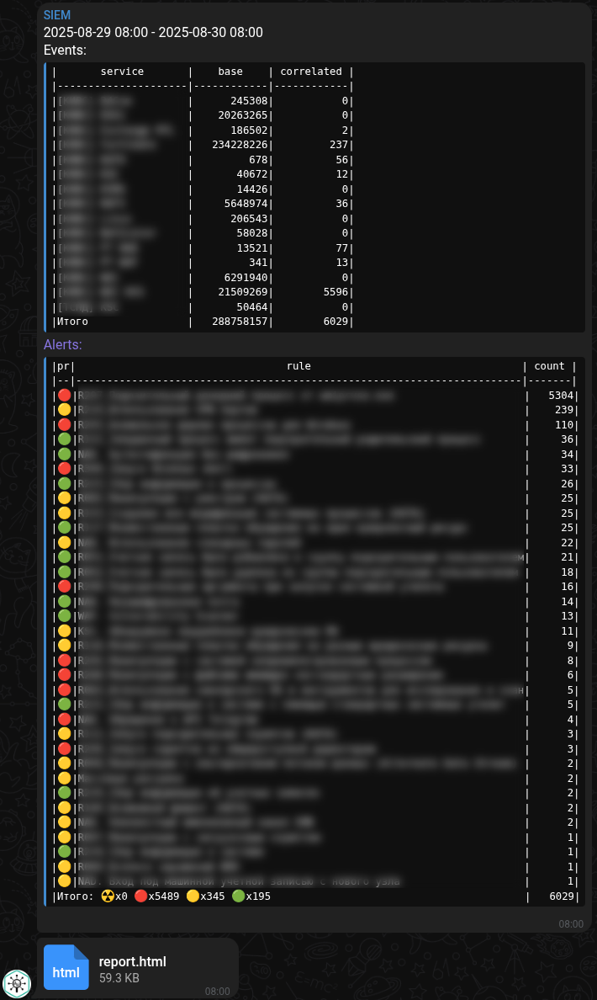

<div align="center">
    
    <h1><a href="https://lp.kaspersky.com/ru/kuma">Kaspersky Unified Monitoring and Analysis Platform</a></h1>
</div>

### Audit

1. Automatinon configuration
    - [audit.sh](./audit.sh)
        - to send only to SIEM: ```sudo bash audit.sh -h siem.example.com -p 5140```
        - for logging to a file only: ```sudo bash audit.sh -s```
        - for logging to a file and SIEM: ```sudo bash audit.sh -h siem.example.com -p 5140 -s```
2. Manual configuration
    - [LinuxAuditLogs.md](./LinuxAuditLogs.md)

### Notifications

1. Correlation events:
    - [telegram-alert.sh](./telegram-alert.sh)

        KUMA response rule:

        ```sh
        ./telegram-alert.sh
        --proxy <proxy address:port> --chat <telegram chat id> --thread <telegram mesage thread id> --tg <telegram bot token> --message "{{if eq .Priority 1}}🟢{{end}}{{if eq .Priority 2}}🟡{{end}}{{if eq .Priority 3}}🔴{{end}}{{if eq .Priority 4}}☢️{{end}} <a href=\"https://kuma.example.com:7220/alerts/correlated-events/{{.ID}}?timestamp={{.Timestamp}}&cluster=1460dc0c-2218-46fd-bcde-36ae327c766a\">{{.CorrelationRuleName}}</a>\\n
        time: @{{.Timestamp}}\\n{{if and (ne .DeviceProduct \"\") (ne .DeviceProduct \"KUMA\") (ne .S.url \"\")}}\\n
        product: <a href=\"{{.S.url}}\">{{.DeviceProduct}}</a>{{end}}{{if ne .DeviceAction \"\"}}\\n
        action: {{.DeviceAction}}{{end}}{{if ne .Severity \"\"}}\\n
        severity: {{.Severity}}{{end}}{{if ne .DeviceEventCategory \"\"}}\\n
        category: {{.DeviceEventCategory}}{{end}}{{if ne .Technique \"\"}}\\n
        technique: {{.Technique}}{{end}}{{if ne .SourceAddress \"\"}}\\n
        src.address: {{.SourceAddress}}:{{.SourcePort}} {{.SourceHostName}}{{end}}{{if ne .DestinationAddress \"\"}}\\n
        dst.address: {{.DestinationAddress}}:{{.DestinationPort}} {{.DestinationHostName }}{{end}}{{if and (ne .SourceUserName \"\") (ne .SourceUserName \"-\")}}\\n
        src.user: {{.SourceUserID}} {{.SourceUserName}}{{end}}{{if and (ne .DestinationUserName \"\") (ne .DestinationUserName \"-\")}}\\n
        dst.user: {{.DestinationUserID}} {{.DestinationUserName}}{{end}}{{if and (ne .SourceProcessName \"\") (ne .SourceProcessName \"-\")}}\\n
        src.process: {{.SourceProcessName}}{{end}}{{if and (ne .DestinationProcessName \"\") (ne .DestinationProcessName \"-\")}}\\n
        dst.process: {{.DestinationProcessName}}{{end}}{{if or (ne .ApplicationProtocol \"\") (ne .TransportProtocol \"\")}}\\n
        protocols: {{.ApplicationProtocol}} {{.TransportProtocol}}{{end}}{{if ne .RequestUrl \"\"}}\\n
        url: {{.RequestUrl}}{{end}}{{if ne .Message \"\"}}\\n
        message: {{.Message}}{{end}}"
        ```

        

2. Reports:
    - [telegram-report.sh](./telegram-report.sh)
    - [report-template.html](./report-template.html)

        ```sh
        > crontab -l
        0 8 * * * /opt/kaspersky/kuma/core/scripts/telegram-report.sh -p 'proxy.example.com:8888' --chat '<telegram chat id>' --thread '<telegram mesage thread id>' --tg '<telegram bot token>' --kuma '<kuma token>' --st $(date -u -d '-1 days' +'\%FT\%H:00:00Z') --et $(date -u +'\%FT\%H:00:00Z')
        0 8 * * 1 /opt/kaspersky/kuma/core/scripts/telegram-report.sh -p 'proxy.example.com:8888' --chat '<telegram chat id>' --thread '<telegram mesage thread id>' --tg '<telegram bot token>' --kuma '<kuma token>' --st $(date -u -d '-2 days' +'\%FT\%H:00:00Z') --et $(date -u +'\%FT\%H:00:00Z')
        
        > /opt/kaspersky/kuma/core/scripts/telegram-report.sh -p 'proxy.example.com:8888' --chat '<telegram chat id>' --thread '<telegram mesage thread id>' --tg '<telegram bot token>' --kuma '<kuma token>' --st $(date -u -d '-1 days' +'%FT%H:00:00Z') --et $(date -u +'%FT%H:00:00Z')
        ```

        
